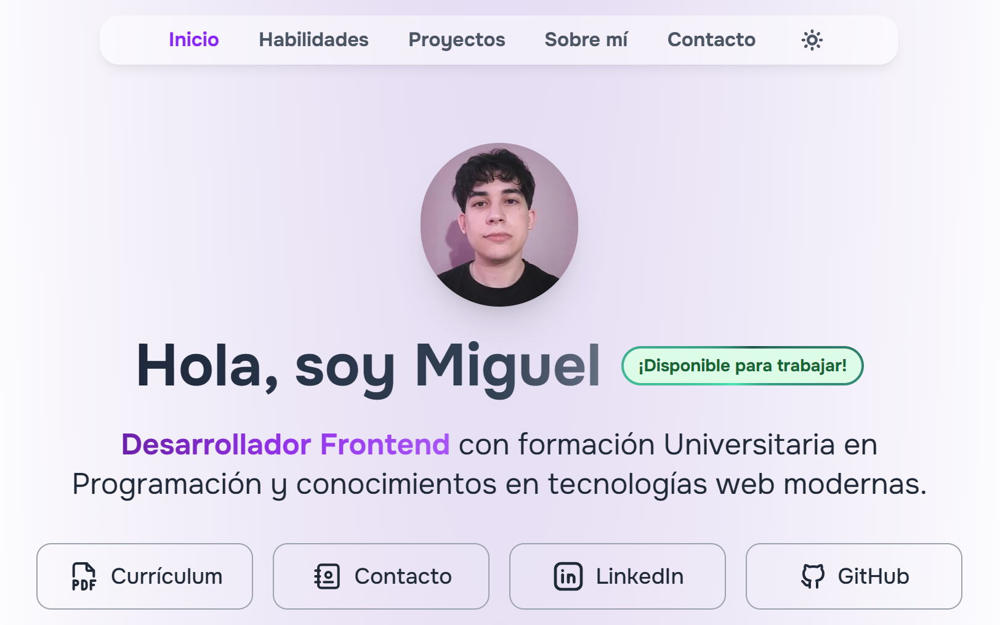

# 💻 Mi Portfolio

Sitio web personal creado con Astro y Tailwind CSS. Es mi carta de presentación, la cual cuenta más sobre mí, cuáles son mis habilidades, proyectos destacados, contacto y demás.

⭐ **[Enlace directo al Portfolio](https://miguel-angel-gil.netlify.app/)**

--- ---

## 📖 Historia y motivos
Este portfolio nació como un ejercicio práctico para aprender **Astro**, un framework moderno y especializado en sitios estáticos. 
Mi objetivo fue crear un sitio **simple, rápido y profesional**, que pueda funcionar como mi carta de presentación en el mundo laboral. 

Elegí **Astro** por su ligereza y simplicidad frente a frameworks más complejos como Angular (con el que tengo experiencia), y lo acompañé con **Tailwind CSS**, un framework de CSS que también aprendí a usar en este proyecto. Me resultó genial para acelerar y tener consistencia en el desarrollo a nivel diseño.

## 🛠️ Stack tecnológico
- ⚡ **Astro** → Microframework para sitios estáticos.  
- 🎨 **Tailwind CSS** → Estilos rápidos gracias a clases utilitarias.  

## ✨ Características
- El portfolio está dividido en 5 secciones:  

  1) **Inicio** → Hero con bienvenida, descripción breve y enlaces rápidos (Curriculum, Contacto, LinkedIn y GitHub).  
  2) **Proyectos** → Mis proyectos principales con imagen, descripción, tecnologías y enlaces.  
  3) **Habilidades** → Listado de skills con iconos, clasificadas en frontend, herramientas y complementos.  
  4) **Sobre mí** → Breve historia personal y trayectoria académica/profesional.  
  5) **Contacto** → Opciones para copiar mi email o abrir la app de correo, además de enlaces directos a LinkedIn.  

- Tiene modo claro y oscuro, el cual se ajusta automáticamente según la preferencia del sistema.

- Tiene un diseño totalmente responsive.

- Excelente Accesibilidad, SEO y rendimiento.

## 📌 Aclaraciones
- Aprendí a hacerlo con un tutorial que me encontré por YouTube del desarrollador [midudev](https://www.youtube.com/@midudev).
- Lo hice a fines de 2024, y le fui haciendo retoques a lo largo de 2025.
